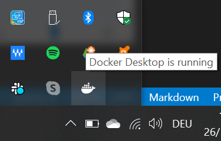

# SnapSearch Backend

Snapserch is a CBIR search app

## Requirements
- Python 3.8
- Postman
- Docker

## Installation

#### Docker for Windows

- Download Docker Desktop:
  [Downolad Docker Installer .exe:](https://desktop.docker.com/win/stable/Docker%20Desktop%20Installer.exe)

- Install Docker Desktop:
  Open the `.exe` file and follow the instructions to install Docker Desktop
  Note: After installation is done, Do NOT reboot

- Download the Linux kernel update package:
  [Downolad Linux kernel .msi](https://wslstorestorage.blob.core.windows.net/wslblob/wsl_update_x64.msi)

- Install Linux kernel update package:
  Open the `.msi` file and follow the instructions to install Linux kernel
  After installation is done, Reboot your machine

- Run Docker:

1. Open Docker Desktop
2. Wait until Docker runs
3. Make sure docker is running in the task bar

- 

## Usage

Open

```bash
cd /team9/snap_search/backend/image_embeddings
```

Build and Run Docker image for the server

```bash
docker build -t image .
```

```bash
docker run -p 5000:5000 image
```

#### Endpoints:

`http://127.0.0.1:5000/createrecords` Runs algorithm on the database images
`http://127.0.0.1:5000/uploadimage/<int:result_num>` Where `/<int:result_num>` is the amount of the photos needed in the result

#### Client server use

- `/createrecords`
  This endpoint expects `GET` request.
  After the request is sent, The algorithm runs on the database images

- `/uploadimage/<int:result_num>`
  This endpoint expects `POST` request.
  The image-to-search-with should be sent in the body with `form-data`
  The key is `input_img`

#### Client server use

Use the endpoint above to send a `post` request.
The image-to-search-with should be sent in the body with `form-data`

# Sprint 2
## Unittest for inference.py

-to run the Unittest of the inference.py write in the terminal
```bash
pyhton test_inference.py
```
-to get the right result you have to run the test twice.
```bash
a-the first run to create the tf_output file and write the data.
b- the seconde run to read the data from tf_output and write it in the embeddings_output.
```
## Contributing

Pull requests are welcome. For major changes, please open an issue first to discuss what you would like to change.

## License

[License](https://gitlab.rz.htw-berlin.de/softwareentwicklungsprojekt/wise2020-21/team9/-/blob/master/LICENSE)
