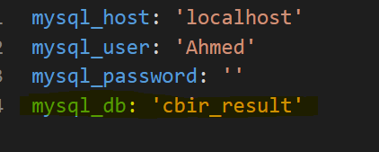
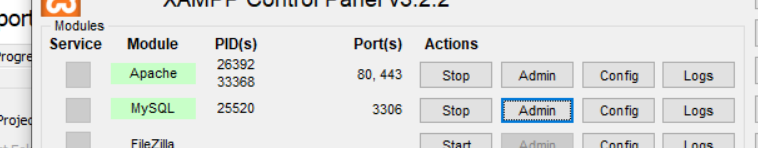
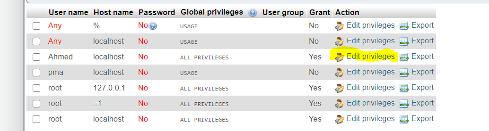
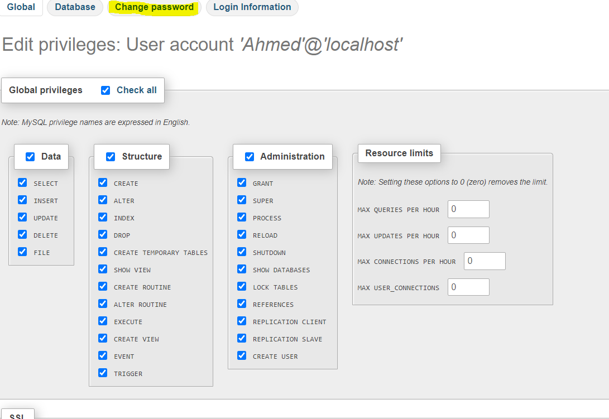
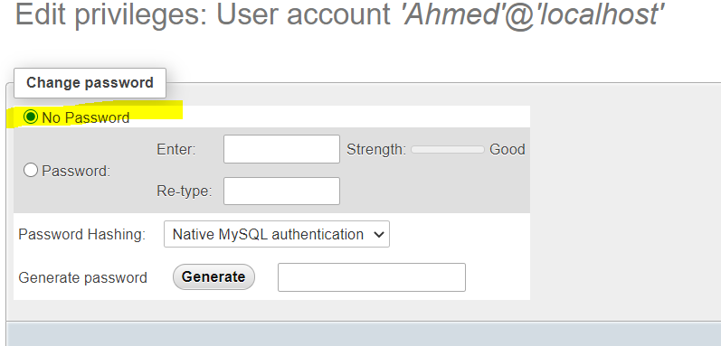

# SnapSearch Backend

Snapserch is a CBIR search app

## Requirements
- Python 3.8
- MySQL Workbench 8.0 CE
- XAMPP Control Panel v3.2.2
- Postman
- Docker

## Installation

#### Docker for Windows

- Download Docker Desktop:
  [Downolad Docker Installer .exe:](https://desktop.docker.com/win/stable/Docker%20Desktop%20Installer.exe)

- Install Docker Desktop:
  Open the `.exe` file and follow the instructions to install Docker Desktop
  Note: After installation is done, Do NOT reboot

- Download the Linux kernel update package:
  [Downolad Linux kernel .msi](https://wslstorestorage.blob.core.windows.net/wslblob/wsl_update_x64.msi)

- Install Linux kernel update package:
  Open the `.msi` file and follow the instructions to install Linux kernel
  After installation is done, Reboot your machine

- Run Docker:

1. Open Docker Desktop
2. Wait until Docker runs
3. Make sure docker is running in the task bar

- 

## Usage

Open

```bash
cd /team9/snap_search/backend/image_embeddings
```

Build and Run Docker image for the server

```bash
docker build -t image .
```

```bash
docker run -p 5000:5000 image
```

#### Endpoints:

`http://127.0.0.1:5000/createrecords` Runs algorithm on the database images
`http://127.0.0.1:5000/uploadimage/<int:result_num>` Where `/<int:result_num>` is the amount of the photos needed in the result

#### Client server use

- `/createrecords`
  This endpoint expects `GET` request.
  After the request is sent, The algorithm runs on the database images

- `/uploadimage/<int:result_num>`
  This endpoint expects `POST` request.
  The image-to-search-with should be sent in the body with `form-data`
  The key is `input_img`

#### Client server use

Use the endpoint above to send a `post` request.
The image-to-search-with should be sent in the body with `form-data`

## Database

The Db (cbir_resualt) contains only one table (result)


### Mysql Dump
- Create Database in Workbench with name for ex:(cbir_resualt) or any other name then
- insert into the db cbir_result_dump.sql to get the table
- then open XAMPP and run Apache and MySQL Server 
### Important 
- if the name of the Db, that you created, isn't (cbir_resualt) then you have to change it in the db.yaml 
- 

## API Server:
### installation:

```bash
pip install Flask
```
```bash
pip install flask-mysql
```
```bash
pip install PyYAML
```

- To run the server of the Api go to Database file 
```bash
- cd \team9\snap_search\backend\Database
```
- and then run dbAPI.py
```bash
python dbAPI.py
```
**Make sure that you have python version 3.8.6

## Test the Db

- To test and populate the result table open Postman

## Endpoints
### POST Requests:
- make post request to populate-endpoint and pass the following params
- `http://127.0.0.1:5000//populate/<photoId>/<photoName>/<photoUrl>`
- the post request should look like that
- `http://127.0.0.1:5000//populate/1/flower/photo/url`
### GET Requests:
- make get request to query the db and return url of the photo
- `http://localhost:5000/reults`
- creat json object in the body of the get request in Postman berfor making the request
- the json should look like that
- the key is same as photoName
```bash
{
"flower" : { 
},
"plume":{
}
}
```

## Connection

### Db Configuration:

- The configurations are saved in db.yaml file and you can change it in the same file

```bash
mysql_host: 'localhost'
```

```bash
mysql_user: 'Ahmed'
```

```bash
mysql_password: '' -> Without Password
```

```bash
mysql_db: 'cbir_result'
```
## Potential Errors while testing the Db
- to avoid that error:
```bash
access denied for user 'Ahmed'@'localhost' (using password yes or NO)
```
- 1- open PHPMyAdmin
- 
- 2- go to User accounts on the menu bar at the top
- 3- then use the configuration data in section Db Configuration to Add user account, if you didn't create it yet 
- 4- choose Ahmed Useranme from the table and click Edit privileges
- 
- 5- click change password
- 
- 6- select no password
- 
- 7- dont forget to click Go at the end of the page
- 8- if you still have the same error try to select (No Password) for the "root" user too 
## Contributing

Pull requests are welcome. For major changes, please open an issue first to discuss what you would like to change.

## License

[License](https://gitlab.rz.htw-berlin.de/softwareentwicklungsprojekt/wise2020-21/team9/-/blob/master/LICENSE)
